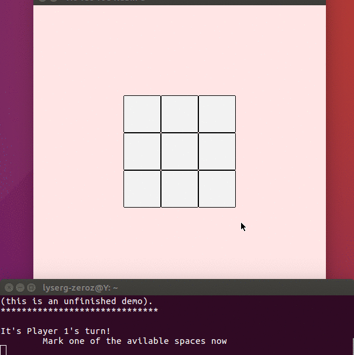

# Rubik'd Tic Tac Toe
This is a prototype of a game that mixes the rules of Tic-Tac-Toe with the topology and mechanics of a Rubik’s Cube.
Usual Rubik’s Cube’s color scheme is ignored; this game is played with a completely blank Cube and tools to draw on it.

## The following are a set of rules for the game.
### Proposed core rules:
- Like in Tic-Tac-Toe, each turn a player draws an X or an O in the front face of the cube. (drawing phase)
- After drawing, they must rotate any one of the cube’s faces that can be accessed via the frontal face, meaning that the bottom and standing faces are not valid rotations. (turning phase)
- They can only draw on the frontal face.
- Rotations must be a ±90° turn only
- If in any face of the cube there is a winning Tic-Tac-Toe board, the game is over and the winner is whoever won in that face. A tie with two winners might occur (unlike regular tic-Tac-Toe, where ties can only occur by running out of moves)
- The game is over only after the final turn has been made. Getting to a winning Tic-Tac-Toe configuration will not win you the game at the “drawing phase”.

### Possible or alternative rules:
- The cube can only be seen, at all times from the front face, so that all other faces are always hidden (none of that exploring the rest of the faces nonsense. Players gotta have great memory now). A less severe limitation could be allowing the cube to be seen only during the drawing phase (this is how it works right now, thou the players could just apply their own house-rules and decide they won't look).
- If the front face is full at the start of a player’s turn, instead of declaring the game a draw, that player may skip the drawing phase.

(name not final P= )

Here's how it looks: 

(same example as in the Rules and Example pdf... actually I guess I could delete that pdf)
